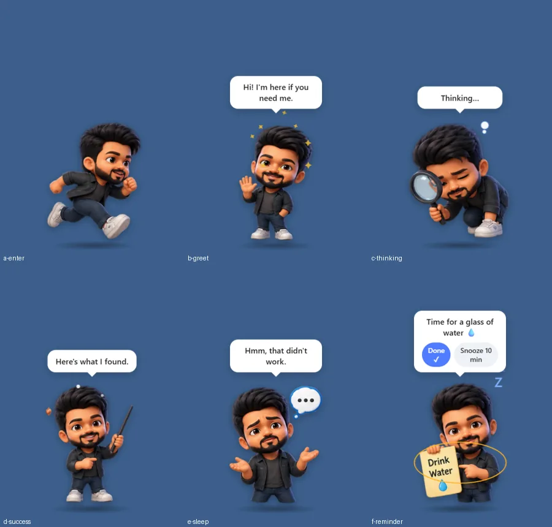
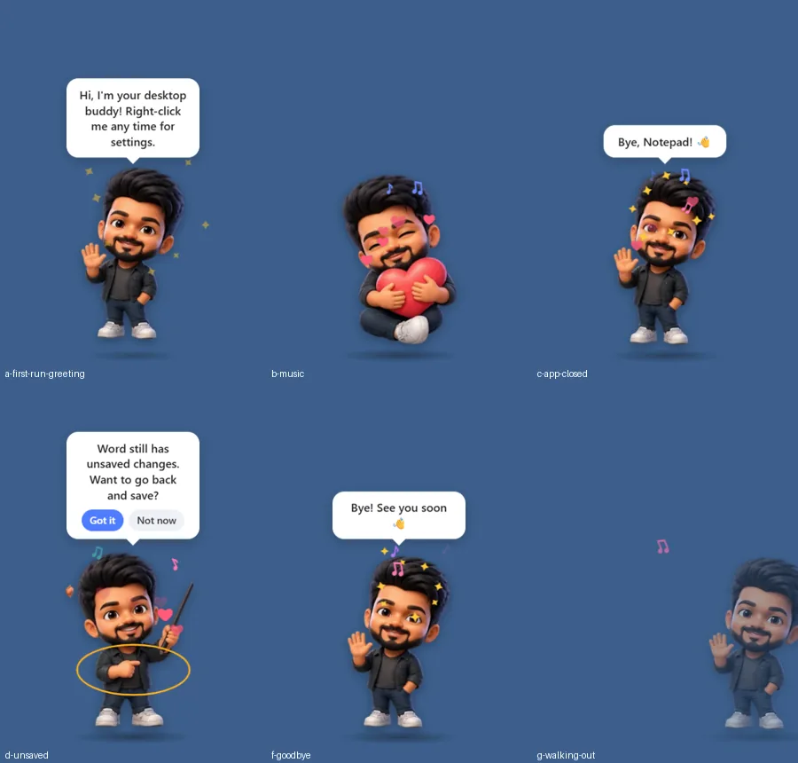
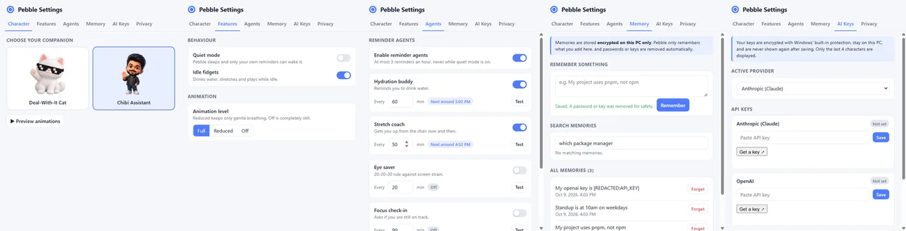

# Pebble 🪨

A friendly animated companion that lives on your Windows desktop. It reminds you to drink water and take breaks, reacts to what you're doing, and remembers what you ask it to, all **privately on your own PC**.

Inspired by the classic Office assistant, rebuilt with modern security and privacy in mind. A fun side project, not affiliated with Microsoft.



---

## Features

### 🎭 Characters and animation
- Two companions: **Chibi Assistant** and **Deal-With-It Cat**. Switch any time.
- More than 30 poses with layered motion: breathing, swaying, squash-and-stretch, a ground shadow, and a run-in entrance.
- Particle effects: sparkles, confetti, floating "Zzz", thought bubbles, hearts, music notes.
- Greets you by time of day, waves goodbye when you quit.
- Animation level **Full / Reduced / Off**, and respects Windows' "reduce motion" setting.

### ⏰ Reminder agents
- **Hydration buddy**, **Stretch coach**, **Eye saver** (20-20-20) and **Focus check-in**, each with its own on/off switch and interval.
- Your own one-time reminders ("Team meeting at 3pm").
- Built not to nag: at most 3 reminders an hour, one at a time, held back while you're focused, silent in Quiet Mode.

### 👀 Activity awareness (off until you allow it)



| You… | Pebble… |
|---|---|
| search (Google, Bing, Edge, DuckDuckGo, Windows search) | grabs the magnifier |
| play music (Spotify, VLC, YouTube Music…) | grooves with floating ♪ notes |
| leave an app with unsaved changes | asks if you want to go back and save |
| close an app you were using | waves goodbye |
| step away or lock the PC | naps, then says "Welcome back!" |

Pebble only **asks**. It never clicks, types, saves or closes anything in other apps.

### 🧠 Memory
- Tell Pebble things to remember ("My project uses pnpm") and search them later.
- Small built-in vector database, **encrypted on your PC**. Passwords and API keys are removed automatically before saving.

### 🔑 Bring your own AI key
- Anthropic (Claude), OpenAI and Google (Gemini), one key slot each, with a free **Test** button.
- Keys are encrypted with Windows' built-in protection (DPAPI) and never shown again after saving (only the last 4 characters).

### ⚙️ Settings window



---

## Privacy

- **No tracking, analytics or telemetry.** Nothing about you is collected, and nothing is used for training by Pebble.
- **Everything works offline.** Only the AI key **Test** button (and future chat) uses the internet, and **Offline Mode** blocks even that.
- **Activity awareness is opt-in** through a Windows dialog. Window titles are turned into labels like "music" and thrown away immediately: never saved, never logged, never sent anywhere. Private/incognito windows and password managers are ignored.
- **Delete all my data** in Settings → Privacy removes keys, memories, reminders and settings.
- Note: **Google Gemini's free tier** may use what you send it to improve Google's products. The Anthropic and OpenAI APIs don't train on your data by default. Check each provider's current terms.

How keys are protected in detail: [docs/api-key-security.md](docs/api-key-security.md)

---

## Install

### Option A: Installer (easiest)

1. Build it once (see *Run from source* below), then run `npm run dist`.
2. Open `dist/Pebble Setup 1.0.0.exe` and follow the steps.
3. Windows may show **"Windows protected your PC"** because the app isn't code-signed. Click **More info → Run anyway**.

The installer is about 100 MB, almost all of it the Electron runtime. Pebble itself is about 2 MB.

### Option B: Run from source

**You need:** Windows 10/11, [Node.js](https://nodejs.org/) 20 or newer (LTS), and [Git](https://git-scm.com/).

```powershell
git clone https://github.com/sanjith3057/pebble.git
cd pebble
npm install
npm start
```

Tip: keep the project **outside OneDrive** (for example `C:\dev\pebble`). Syncing `node_modules` is slow and causes file-lock errors.

---

## Using Pebble

| Action | How |
|---|---|
| Move Pebble | Drag the character |
| Say hi | Click the character |
| **Open settings** | **Right-click** the character, or tray icon → **Settings…** |
| Switch character | Settings → Character, or tray → Character |
| See all animations | Tray → **Preview Animations** |
| Quiet Mode | Tray → Quiet Mode (Pebble sleeps; only your own reminders can wake it) |
| Turn on activity awareness | Settings → **Privacy** → Turn on… |
| Hide / quit | Tray → Hide Pebble / Quit Pebble |

The tray icon is the small blue circle near the clock (click **^** if it's hidden).

---

## Commands

| Command | What it does |
|---|---|
| `npm start` | Run Pebble |
| `npm test` | Run all tests (255, including security and privacy tests) |
| `npm run test:coverage` | Tests plus a coverage report |
| `npm run pack` | Build an unpacked app in `dist/win-unpacked` (quick check) |
| `npm run dist` | Build the Windows installer in `dist/` |
| `npm run optimize` | Compress new character poses to WebP (needs Python + Pillow) |

---

## Add your own character

You need a sticker sheet as a **transparent PNG**, plus Python 3 with `pip install pillow numpy scipy`.

1. Cut the sheet into poses (names in reading order, left to right, top to bottom):
   ```powershell
   python scripts/extract-poses.py design/source-sheets/my-sheet.png apps/desktop/assets/characters/mychar/poses idle wave thinking ...
   ```
2. Create `apps/desktop/assets/characters/mychar/manifest.json`. Copy `cat/manifest.json` and map the states (`idle`, `greet`, `curious`, `thinking`, `talking`, `success`, `warning`, `error`, `sleep`, plus optional `enter`, `search`, `music`) and the `reminders` (`water`, `break`, `work`, `meeting`, `save`) to your poses.
3. Run `npm run optimize` to shrink the images.
4. Restart Pebble. The character appears in Settings and the tray menu.

Manifests are validated on load, so a character pack can't point to files outside its own folder.

---

## Project structure

```text
apps/desktop/        Electron app: windows, character, settings UI, preloads
  assets/characters/ Character packs (manifest.json + poses/*.webp)
core/
  activity/          Activity classifier + monitor (privacy-first)
  agents/            Reminder agents and their coordinator
  intervention/      "Should Pebble interrupt now?" scoring engine
  memory/            Vector store + lightweight embedder
  context/, conversation/, planner/, policy/   AI-safety building blocks
security/            Permissions, path sandbox, encrypted secret storage
adapters/            Windows window reader (read-only)
tools/               Tool contracts for future AI actions
tests/               Unit, integration, security, privacy and UX tests
scripts/             Pose extraction and asset optimizer
docs/                Security guide and screenshots
design/              Source sticker sheets (not shipped in the app)
```

The full architecture is in [Clippy-2.0-System-Design.md](Clippy-2.0-System-Design.md).

### Security at a glance
- Every window runs sandboxed, with context isolation and no Node access in pages.
- Strict Content Security Policy; pages can't reach the internet at all.
- IPC accepts each message only from the one page meant to send it.
- AI tool calls must pass permission, risk and confirmation checks (destructive commands always need approval).

---

## Troubleshooting

| Problem | Fix |
|---|---|
| `Cannot read properties of undefined (reading 'requestSingleInstanceLock')` | The `ELECTRON_RUN_AS_NODE` variable is set in your terminal. Run `Remove-Item Env:ELECTRON_RUN_AS_NODE`, then `npm start`. |
| Can't find Pebble | Click the tray icon or tray → Show Pebble. |
| Activity awareness does nothing | Turn it on in Settings → Privacy. It's Windows-only and reacts to known apps and sites. |
| Memory search misses something | The built-in search matches shared words, not meaning: search for a word that's in the memory. |
| "Windows protected your PC" | The app isn't code-signed. Click More info → Run anyway. |

---

## Roadmap

- [ ] Chat with Pebble (using your own AI key, only when you ask)
- [ ] More cat poses (headphones, play, eat…)
- [ ] Smarter memory search with a small local AI model
- [ ] Code signing and auto-updates

---

## License

[GNU GPL v3.0](LICENSE)
